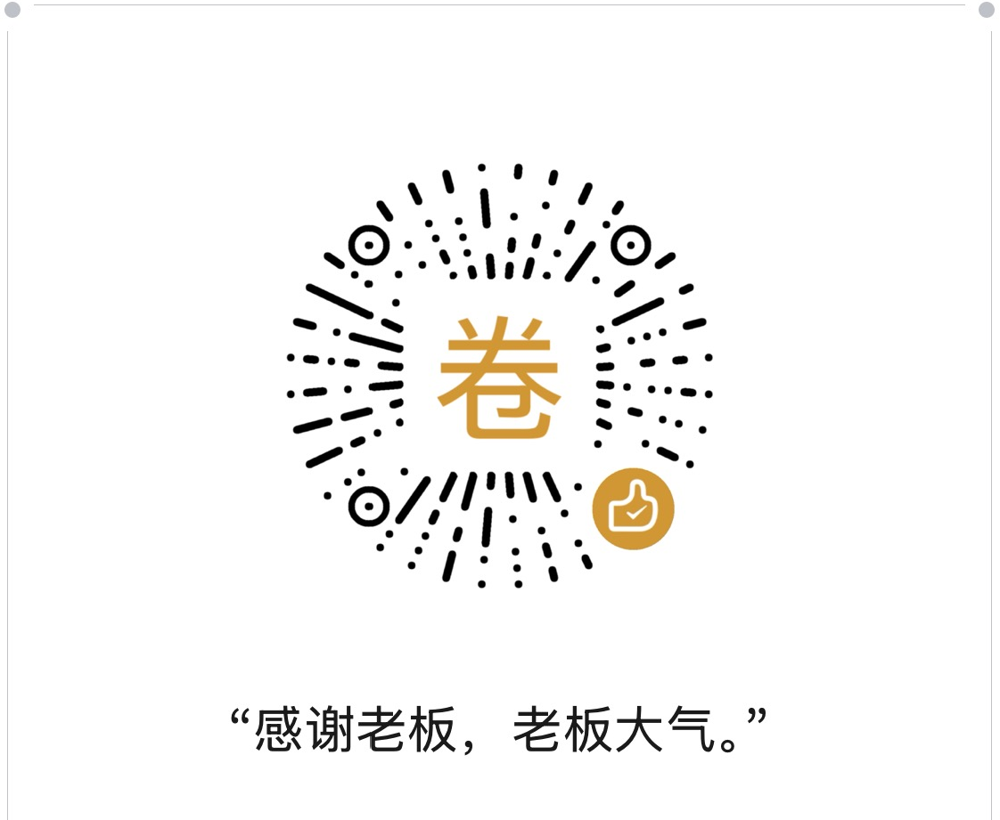

[](https://pypi.org/project/ruhui/)
[](https://opensource.org/licenses/Apache-2.0)
[](https://huggingface.co/anyforge/ruhui)
[](https://modelscope.cn/models/anyforge/ruhui)

# Ruhui · 如晦

**非自回归 System 1 决策引擎（中文/多语言），带校准概率。**

命名取自「房谋杜断」的杜如晦（字克明），「晦」音近「hui」。房玄龄善谋、杜如晦善断——Ruhui 取「断」之意：快速做 System 1 决策，不生成文本、无可解析输出、因此无幻觉。

---

## 是什么

Ruhui 在**单次前向传播**里回答**类型化问题**——`choice`（选择）、`score`（评分）、`noul`（是/否）——对任意状态（文本、邮件、工单、JSON）给出每个选项的**校准概率**。不生成文本、不解析、不幻觉。

两个后端共用同一接口：

| 后端 | 架构 | 大小 | 延迟 | 优势 |
|---|---|---|---|---|
| **bert** | 双向编码器（mmBERT-base）+ 决策头 | 322M | ~33ms | 快、CPU 可跑、中英双语 |
| **llm** | Causal LM（Qwen3.5）+ LoRA + PointerHead | 0.8B+ | 数百 ms | 通用泛化更强 |

---

| 资源 | 链接 | 说明 |
|---|---|---|
| 📦 **PyPI** | [](https://pypi.org/project/ruhui/) | `pip install ruhui -U` |
| 🐙 **GitHub** | [](https://github.com/anyforge/ruhui) | 源码 + 双语 README + skill |
| 🧩 **ModelScope** | [](https://modelscope.cn/models/anyforge/ruhui) | 模型仓库（bert + 0.8B） |
| 🤗 **Hugging Face** | [](https://huggingface.co/anyforge/ruhui) | 模型仓库（bert + 0.8B） |
| 🛠️ **OpenClaw Skill** | [](https://clawhub.ai/anyforge/skills/ruhui) | 智能体技能（ClawHub） |
| 🛠️ **ModelScope Skill** | [](https://www.modelscope.cn/skills/anyforge/ruhui) | 智能体技能（魔搭） |
---

## 安装

```bash
pip install ruhui -U
```

Python 3.10+。核心依赖：`torch`、`transformers`、`safetensors`、`huggingface_hub`、`numpy`。LLM 后端额外需要 `peft`。

---

## 快速开始

### llm 后端（大模型，通用性更强）

```python
from ruhui.llm import LLMAgent

# 合并后的完整模型（自包含，无需 base_dir）
agent = LLMAgent(checkpoint_dir="/path/to/anyforge/ruhui/0.8B")

# choice task

result = agent.predict(
    {"message": "我被重复扣款了，请退款"},
    {"intent": {"type": "choice", "instructions": "客户想做什么？",
                "criteria": {"refund": "退款", "billing": "账单"}}},
)
print(result["answers"])

# score task

result = agent.predict(
    {"message": "我被重复扣款了，客服三天没回复，今天必须解决，不然就取消订阅！"},
    {
        "frustration": {
            "type": "score",
            "instructions": "客户有多生气？",
            "criteria": ["平静", "有点不满", "明显恼火", "非常愤怒，威胁投诉"],
        },
        "urgency": {
            "type": "score",
            "instructions": "这件事有多紧急？",
            "criteria": ["不急", "需尽快处理", "紧急且阻塞"],
        },
    },
)
print(result["answers"])

# noul task

result = agent.predict(
    {"message": "不然我就取消订阅，去用你们竞争对手的产品"},
    {
        "churn_risk": {
            "type": "noul",
            "instructions": "客户是否威胁要离开或取消？",
        },
        "refund_requested": {
            "type": "noul",
            "instructions": "客户是否明确要求退款？",
        },
    },
)
print(result["answers"])

```

### bert 后端（原版，用法不变）

```python
import ruhui

agent = ruhui.load("/path/to/anyforge/ruhui")   # 从仓库拉取，或本地目录

result = agent.predict(
    {"message": "我被重复扣款了，请退款"},
    {
        "intent": {"type": "choice", "instructions": "客户想做什么？",
                   "criteria": {"refund": "退款", "technical": "技术问题", "billing": "账单咨询"}},
        "churn_risk": {"type": "noul", "instructions": "客户是否威胁要离开？"},
    },
)
print(result["answers"])
```

---

## 两个后端的技术原理

### bert 后端 —— 编码器 + 决策头

双向编码器读完整段输入，然后一个 2 层决策头在每个选项自己的 `[MASK]` 槽位上**并行打分**。概率来自这些选项槽位上的 softmax，用 **RLCD**（严格恰当评分规则奖励的强化学习）训练，因此报告的置信度在统计上是有意义的。

```
[CLS] 问题 + [MASK] 选项0 [MASK] 选项1 ... [SEP] 状态 [SEP]
   → 双向编码器
   → 取出 [MASK] 槽位向量
   → 并行打分器 → softmax → 校准概率
```

### llm 后端 —— Causal LM + PointerHead（KEV 式）

冻结的因果语言模型只做 **prefill**（从不生成 token）。每个问题成为一个分支，共享同一个状态前缀，用 block-causal mask 隔离。指针头读取 `<decide>` 位置，去「指向」选项边界 token——注意力分数即选项概率。

```
[状态] [问题: 指令 <opt>选项A</opt> <opt>选项B</opt> <decide>]
   → Causal LM（仅 prefill）
   → PointerHead: q(decide) · k(选项) → logits → softmax
```

LoRA 适配器在推理时折进底座权重（或用 `merge_model.py` 永久合并）。

---

## 决策原语

| 原语 | 输出 |
|---|---|
| `choice` | top 标签 + 全概率分布 + 置信度 |
| `score` | 有序标度上的期望值 |
| `noul` | 校准的 P(true) |

置信度是归一化熵（`1 − H(p)/log K`），可安全地做门控：

```python
if conf >= 0.85:
    route_automatically(dept)   # 高置信，自动处理
else:
    escalate_to_human(dept)     # 低置信，转人工
```

---

## 微调

### llm 后端（KEV 式）

```bash
# 1. 软标签转 KEV 格式训练数据
python scripts/convert_to_kev.py --soft_dir <目录> --out datas/train.jsonl

# 2. 从已有 checkpoint 微调（delta 模式）
python scripts/finetune.py \
  --data datas/train.jsonl \
  --base Qwen/Qwen3.5-0.8B-Base \
  --init_from anyforge/ruhui/0.8B \
  --out runs/ruhui-0.8b \
  --epochs 2 --device cuda

# 3. 中断后断点续跑
python scripts/finetune.py ... --resume

# 4. 合并 LoRA 进底座（bf16 体积减半）
python scripts/merge_model.py \
  --checkpoint runs/ruhui-0.8b \
  --base Qwen/Qwen3.5-0.8B-Base \
  --out runs/ruhui-0.8b-merged \
  --dtype bf16
```

### bert 后端（Laya 式）

```bash
python scripts/train.py \
  --model_dir <底座目录> \
  --train_items <train_items.pt> \
  --output_dir <输出目录> \
  --epochs 4
```

---

## 目录结构

```
ruhuipro/
  ruhui/
    bert/           # 编码器后端（agent / router / common / presets / ...）
    llm/            # LLM 后端（model / api / checkpoint / train / data / agent）
  scripts/
    convert_to_kev.py      # 软标签 → KEV 格式
    finetune.py            # LLM 微调（--init_from / --resume）
    merge_model.py         # LoRA 合并 + dtype 控制
    train.py               # bert 微调
  tests/
```

---

## 模型仓库

- Hugging Face: `anyforge/ruhui`（根 = bert 模型；`0.8B/` = LLM 0.8B 合并模型）
- ModelScope: `anyforge/ruhui`（同上）

---

## 技能（Skill）

本仓库自带一份开箱即用的智能体技能 [`skills/ruhui/SKILL.md`](skills/ruhui/SKILL.md)，教编码智能体（Claude、Cursor、Codex 等）**何时、如何**把 Ruhui 当作编程原语来用：怎么选原语、怎么设计问题、怎么在脚本或 FastAPI 服务里复用已加载的模型、以及常见坑。直接从本仓库安装，或把该文件加载进你的智能体即可。

---

## 捐献

如果觉得 Ruhui 对您有用，欢迎请作者喝杯咖啡。感谢！🙏



---

## 致谢

- **Laya**（[NandhaKishorM/laya](https://github.com/NandhaKishorM/laya)，Apache 2.0）—— bert 后端 fork 的非自回归 System 1 决策范式与 RLCD 训练方法。
- **KEV**（[jaredpalmer/kev](https://github.com/jaredpalmer/kev)，Apache 2.0）—— llm 后端基于的 Causal LM + LoRA + PointerHead 架构。

## License

Apache 2.0. Developed by AnyForge.
